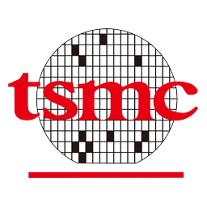
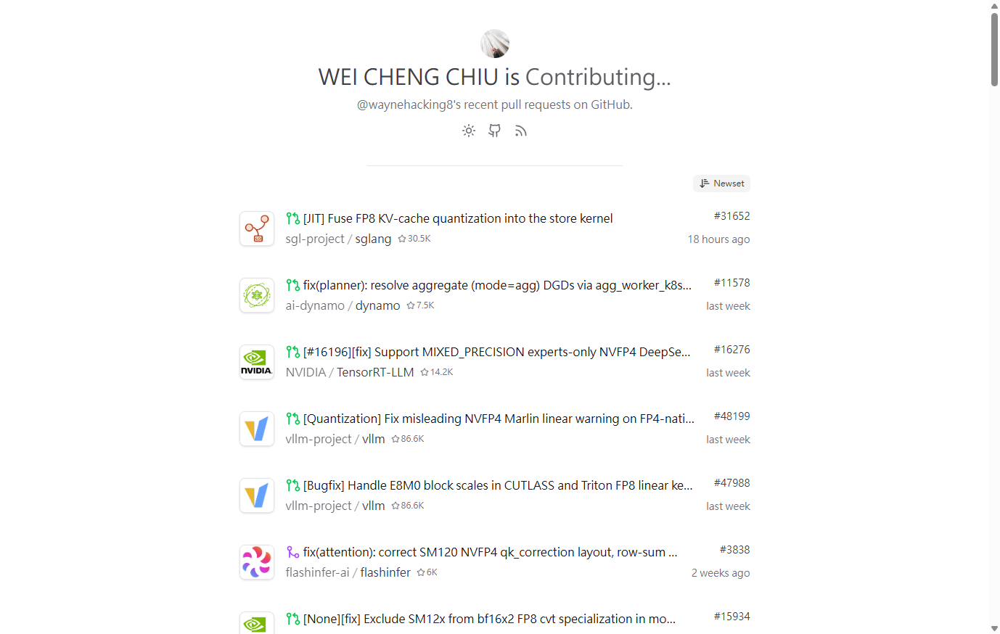

---
hide:
  - navigation
  - toc
---

# About

Hi, I'm **Wayne** 👋 — a GPU performance engineer, happiest when an upstream kernel
fix lands. Currently, I'm a Field Application Engineer at
<a href="https://ailabs.tw/zh/home/">Taiwan AILabs</a>,
deploying on-premises LLM systems (FedGPT) into customer environments — Linux/Kubernetes
operations, GPU serving, and customer-facing troubleshooting.

Previously, I was the sole developer of an enterprise multi-agent AI platform at
<a href="https://syncrobotic.ai/">SYNCROBOTIC</a>, built internal coding agents at
<a href="https://www.advantech.com/en">Advantech</a>,
and served at <a href="https://www.tsmc.com/english">TSMC</a>
under the national R&D program. I hold an M.S. in Computer Science from
<a href="https://www.ntust.edu.tw/">NTUST</a>
(GPA 4.09), where I researched **LLM safety alignment** and **privacy-preserving ML**
in Prof. Shao-Jui Wang's lab.

Outside work I live in the upstream LLM-inference stack — **17 merged/landed patches ·
60 in review** across
<a href="https://github.com/flashinfer-ai/flashinfer">FlashInfer</a>,
<a href="https://github.com/vllm-project/vllm">vLLM</a>,
<a href="https://github.com/sgl-project/sglang">SGLang</a>,
<a href="https://github.com/pytorch/pytorch">PyTorch</a>,
<a href="https://github.com/ai-dynamo/dynamo">Dynamo</a>,
<a href="https://github.com/NVIDIA">NVIDIA</a>
<a href="https://github.com/NVIDIA/cutlass">CUTLASS</a> / <a href="https://github.com/NVIDIA/TensorRT-LLM">TensorRT-LLM</a>, and
<a href="https://github.com/InternLM/lmdeploy">LMDeploy</a> —
see the auto-updating [PR wall](https://prs.wayne.is-a.dev) and [Patches](patches.md).

## Focus

Broadly, I care about **inference performance you can trust** — fast kernels that also
compute the right answer. Three threads:

1. **Serving internals**: KV-cache, quantization trade-offs, attention kernels —
   enough depth to reason about cost and latency *at design time*.
2. **Upstream enablement**: early consumer-Blackwell (**SM120**) and **NVFP4** support
   across kernels → engines → disaggregated serving; my favorite prey is the
   *silent-correctness* bug — tests green, answers wrong.
3. **Trustworthy ML**: safety alignment against harmful fine-tuning; federated
   learning, differential privacy, secure multi-party computation.

## News

<dl>
  <dt>Jul 2026</dt>
  <dd>💼 Joined <a href="https://ailabs.tw/zh/home/"><strong>Taiwan AILabs</strong></a> as a Field Application Engineer —
      on-prem LLM deployments (FedGPT).</dd>
  <dt>Jul 2026</dt>
  <dd>🧱 The <a href="https://prs.wayne.is-a.dev">live PR wall</a> went up — every
      upstream patch, auto-updating.</dd>
  <dt>Jul 2026</dt>
  <dd>📈 Upstream tally: <strong>17 merged/landed · 60 in review</strong> across the
      LLM-inference stack.</dd>
  <dt>Apr 2026</dt>
  <dd>🎓 M.S. in Computer Science from <a href="https://www.ntust.edu.tw/"><strong>NTUST</strong></a>, GPA 4.09.</dd>
  <dt>Jan 2026</dt>
  <dd>📝 <strong>SelGrad</strong> (first-author) submitted — under review at
      <em>IEEE TDSC</em>.</dd>
  <dt>Sep 2025</dt>
  <dd>💼 Joined <a href="https://syncrobotic.ai/"><strong>SYNCROBOTIC</strong></a> — sole developer of an enterprise
      multi-agent platform, shipped at two customers.</dd>
  <dt>Jun 2025</dt>
  <dd>💼 Summer at <a href="https://www.advantech.com/en"><strong>Advantech</strong></a> building internal coding agents.</dd>
  <dt>Dec 2024</dt>
  <dd>📜 <a href="https://learn.nvidia.com/">NVIDIA DLI</a> certificates — Accelerated Computing with CUDA (Python &amp; C/C++).</dd>
  <dt>Aug 2024</dt>
  <dd>🔬 Started graduate research on LLM security &amp; privacy-preserving ML at
      <a href="https://www.ntust.edu.tw/">NTUST</a>.</dd>
</dl>

## Selected Work

<a href="patches/">SM120 / NVFP4 enablement across the LLM-inference stack</a>

<a href="https://github.com/flashinfer-ai/flashinfer">FlashInfer</a> · <a href="https://github.com/NVIDIA/cutlass">CUTLASS</a> · <a href="https://github.com/vllm-project/vllm">vLLM</a> · <a href="https://github.com/sgl-project/sglang">SGLang</a> · <a href="https://github.com/NVIDIA/TensorRT-LLM">TensorRT-LLM</a> · <a href="https://github.com/ai-dynamo/dynamo">Dynamo</a> — kernels to engines to disaggregated serving

CUDABlackwellNVFP4

<a href="https://prs.wayne.is-a.dev">Live PR wall — prs.wayne.is-a.dev</a>

Auto-updating feed of every upstream contribution, with <a href="https://prs.wayne.is-a.dev/feed.xml">RSS</a>

Open Source17 merged60 in review

SelGrad: Selective Gradient Projection for Efficient Safety Alignment Against Harmful Fine-Tuning

<b>Wei-Cheng Chiu</b>, et al. — under review at <em>IEEE TDSC</em>

SafetyAlignment

<a href="projects/">Enterprise multi-agent AI platform</a>

PoC → production at two enterprise customers — routing layer, planning/execution/validation orchestration, hybrid RAG

AgentsRAGvLLM

## Misc

I'm from Taiwan :flag_tw: and based in Taipei. Away from a profiler you'll find me tending an
over-engineered Obsidian vault. The views on this site are my own and do not represent
those of my employer or affiliated institutions.
